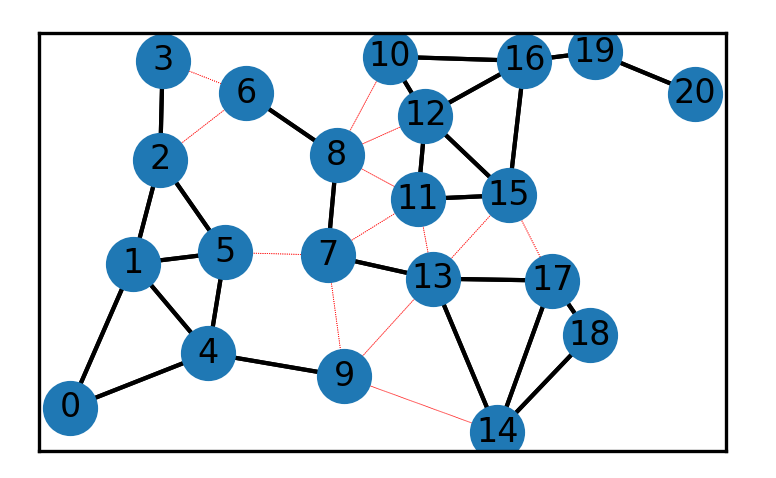
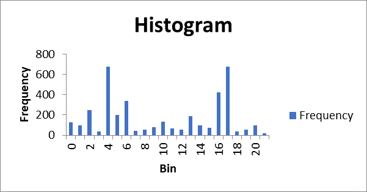

# Redistricting-USA
Redistricting Algorithm
## Introduction

The aim of this report is to carry out redistricting exercise itself using the MCMC algorithm. The MCMC algorithm is supposed to accept or reject the candidates using the Metropolis criterion. This process is supposed to be iterated at least 1000 times such that the sampling process will be valuable. Every other resulting plan is to recorded, and the results visualized in a plot of the number of nodes and histogram. 
Process

The redistricter code has been already tested to be running. From a one-time execution, the plot below is obtained:

 
There is need for a full automation of the redistricting simulator using Markov Chain Monte Carlo (MCMC). To be able to simulate the boundaries, there will be need to formulate the problem into nested subgraphs, that is, subdividing the plot above into multiple graphs. The algorithm to be executed is then imposed into sampling plan where the adjacency matrix in the code determines the districts to be included in a single run. The prespecified constraints in the code are the number of runs set to be performed in each iteration. The computation of the true population, however, is not feasible because the empirical performance of the MCMC algorithms involves the elimination of the partisan bias.

## How the Code Works
To implement the process with the redistricter code already provided, there will be some modifications to the code. First, the plan is to initialize the code by picking up the plan class. The MCMC implementation will be the redistricter class. Since the redistricter class has the set initial plans, there will be a need to run it 1000 times by using the perform transition. The doubled loop populate the sampled-plans 1000 times will reflect the objects, and the MCMC redistricter class pulls the relevant information into the sampled plans. For the redistricter class, the proposal stage is to identify all the nodes in the district boundaries. There will be need to select a node - 0. Then, identify all the districts to which the node is connected to, which is 1 and 4. Next in the iteration process, it will be to assign a different node say 1, and then apply the subsequent stages to it. After which, a connecting district is selected at random. The current_plan and recursive of the steps assigned a name, candidate_plan. An attempt to move a node in the candidate plan is initiated. If it fails, then the steps above are repeated again. If it succeeds, then the node is saved and proceeded to the acceptance or rejection stage.

In the acceptance or rejection stage, there is need to validate the redistricting plan in the proposal stage. To make this decision, we compute the probabilities between the current and candidate plans. After that, the acceptance ration is calculated and compared to a random number then the decision made.
For the multiple runs, for each substitution of the district node, the following runs were obtained:

|Bin |Frequency|
|----|---------|
|0	|128|
|1	|98|
|2	|246|
|3	|34|
|4	|675|
|5	|199|
|6	|340|
|7	|45|
|8	|56|
|9	|77|
|10	|132|
|11	|67|
|12	|54|
|13	|187|
|14	|99|
|15	|76|
|16	|423|
|17	|678|
|18	|34|
|19	|54|
|20	|98|

The precincts of each district was set to compare the actual redistricting plan to its frequencies or the distribution. The aim is to detect gerrymandering in each specific run. From the runs attained above, it was hard to develop a consistent approach to evaluate them, thus making the development of such an algorithm to be difficult. 

## Histogram

For the histogram, the partitions developed at individual random runs, it can be depicted that it is extremely difficult to yield same number of partitions in each individual run. Besides, the problem of the enumeration of each individual run can be non-tractable event, hence cannot be applied in the realistic redistricting runs. From there multiple runs, the MCMC algorithm should, therefore, be implemented to obtain representative and dependent sample from the uniform valid redistricting plans implemented. 

## Conclusion

The implementation of the code is a success of the utilization of the MCMC algorithm in the redistricting problem. The use of iteration method with setting of precincts to districts ensures that the algorithm is effective, implementable and eradicates bias. What should be noted is that the implementation of the redistricter code saw the corresponding manipulations at the instantaneous randomly selected adjacent nodes using the Metropolis criterion. This practice of the selection of the specific nodes within the implementation ensured no bias since there are different probabilities of choosing between the nodes in each run. In running the MCMC code, the assigning of the nodes was successful because of the randomness attributed to the instance variables. 
